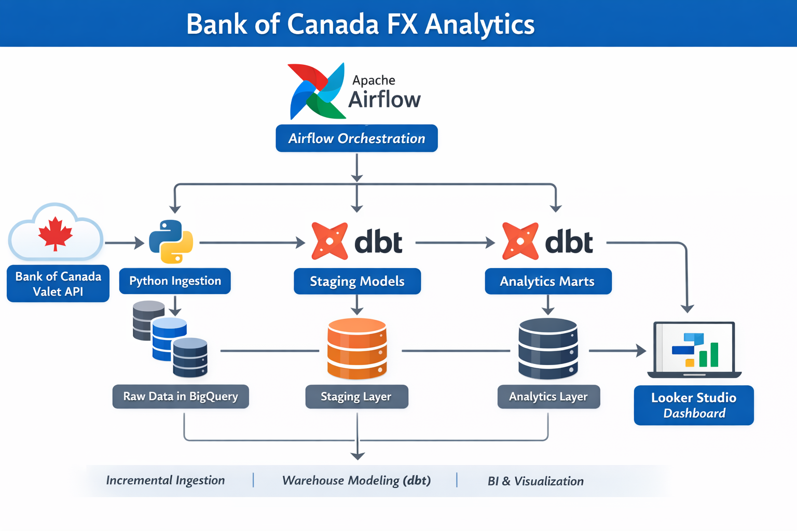
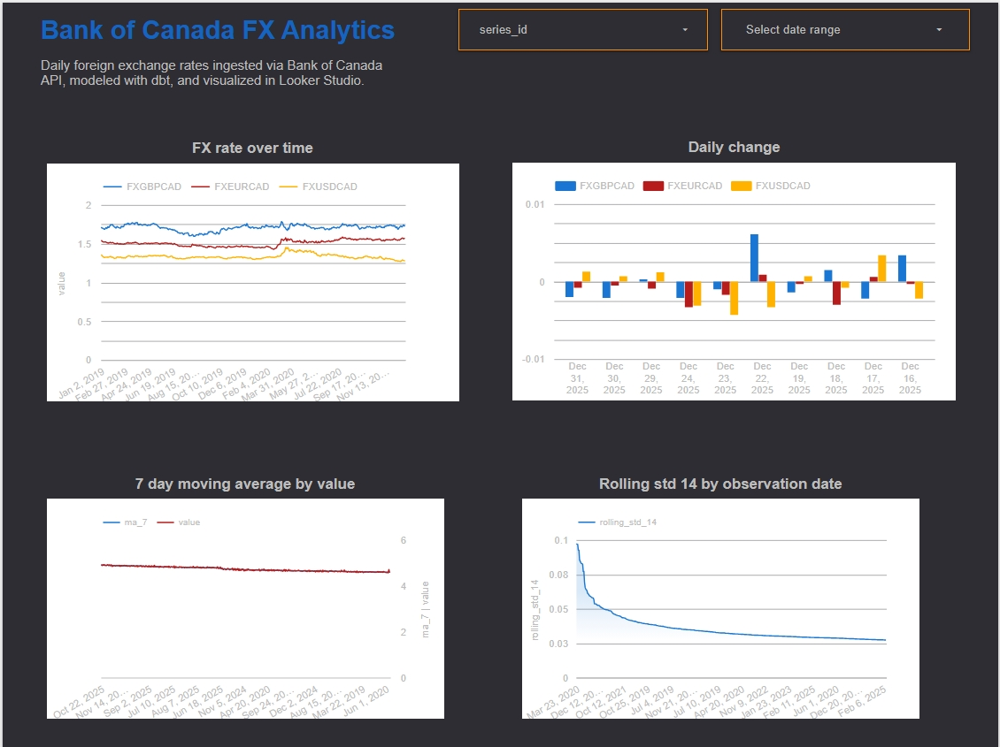

# Bank of Canada FX Analytics Platform

## Overview
This project implements an **end-to-end batch analytics pipeline** for foreign exchange (FX) data using the Bank of Canada Valet API.

The platform ingests daily FX observations, stores them in a cloud data warehouse, transforms them using analytics engineering best practices, and exposes analytics-ready tables for visualization and exploration.

The goal of the project is to demonstrate **real-world data engineering patterns**, including:
- API ingestion
- Incremental and idempotent batch processing
- Warehouse-first modeling
- Analytics feature engineering
- Orchestration and data quality testing

---

## Architecture Overview

**Source → Raw → Staging → Analytics → Dashboard**

- **Source**: Bank of Canada Valet API (FX observations)
- **Raw**: Incrementally ingested, partitioned BigQuery tables
- **Staging**: Cleaned and typed dbt models
- **Analytics**: Fact and feature marts optimized for analysis
- **Visualization**: Looker Studio dashboard

## Architecture

[](docs/images/architecture.png)

---

## Data Ingestion

FX data is pulled from the Bank of Canada Valet API using a Python ingestion module.

### Ingestion Features
- Supports **incremental loads** based on the latest loaded date
- Supports **manual historical backfills**
- Loads data into a staging table and merges into the raw table
- Ensures **idempotency** via BigQuery `MERGE`

### Raw Table
**`raw.boc_fx_observations`**
- Partitioned by `observation_date`
- Clustered by `series_id`
- One row per currency pair per day

---

## Warehouse Modeling (dbt)

Transformations are implemented using dbt following analytics engineering best practices.

### Staging Layer
**`staging.stg_boc_fx_observations`**
- Cleans and types raw FX observations
- Enforces non-null constraints
- Acts as the canonical, trusted source for downstream models

### Analytics Layer

#### Daily FX Rates
**`analytics.fct_fx_rates_daily`**
- One row per currency pair per day
- Primary fact table for FX analysis

#### Feature Engineering
**`analytics.fct_fx_features`**
Derived analytical features:
- Daily absolute change
- Daily percentage change
- 7-day moving average
- 14-day rolling standard deviation (volatility proxy)

These features support trend analysis, volatility analysis, and visualization.

## Dashboard


---

## Data Quality

Data quality is enforced using dbt tests:
- `not_null` checks on key fields
- Uniqueness constraints on `(series_id, observation_date)`
- Source freshness checks on raw ingestion

This ensures reliability and trust in downstream analytics.

---

## Orchestration (Airflow)

This project includes an Apache Airflow DAG that orchestrates:

- FX data ingestion into BigQuery
- `dbt run`
- `dbt test`

The DAG is designed for **production deployment** (e.g., Cloud Composer) and supports:
- Scheduled incremental runs
- Manual backfill execution via DAG parameters

Airflow is **not required to be installed locally** to run the core pipeline logic.

---

## Visualization

Analytics tables are visualized using **Looker Studio**, connected directly to BigQuery.

The dashboard includes:
- FX rates over time
- Daily changes
- Trend vs smoothed averages
- Volatility over time

> Screenshot available in `docs/images/dashboard.png`

---

## Repository Structure

# Bank of Canada FX Analytics Platform

## Overview
This project implements an **end-to-end batch analytics pipeline** for foreign exchange (FX) data using the Bank of Canada Valet API.

The platform ingests daily FX observations, stores them in a cloud data warehouse, transforms them using analytics engineering best practices, and exposes analytics-ready tables for visualization and exploration.

The goal of the project is to demonstrate **real-world data engineering patterns**, including:
- API ingestion
- Incremental and idempotent batch processing
- Warehouse-first modeling
- Analytics feature engineering
- Orchestration and data quality testing

---

## Architecture Overview

**Source → Raw → Staging → Analytics → Dashboard**

- **Source**: Bank of Canada Valet API (FX observations)
- **Raw**: Incrementally ingested, partitioned BigQuery tables
- **Staging**: Cleaned and typed dbt models
- **Analytics**: Fact and feature marts optimized for analysis
- **Visualization**: Looker Studio dashboard

---

## Data Ingestion

FX data is pulled from the Bank of Canada Valet API using a Python ingestion module.

### Ingestion Features
- Supports **incremental loads** based on the latest loaded date
- Supports **manual historical backfills**
- Loads data into a staging table and merges into the raw table
- Ensures **idempotency** via BigQuery `MERGE`

### Raw Table
**`raw.boc_fx_observations`**
- Partitioned by `observation_date`
- Clustered by `series_id`
- One row per currency pair per day

---

## Warehouse Modeling (dbt)

Transformations are implemented using dbt following analytics engineering best practices.

### Staging Layer
**`staging.stg_boc_fx_observations`**
- Cleans and types raw FX observations
- Enforces non-null constraints
- Acts as the canonical, trusted source for downstream models

### Analytics Layer

#### Daily FX Rates
**`analytics.fct_fx_rates_daily`**
- One row per currency pair per day
- Primary fact table for FX analysis

#### Feature Engineering
**`analytics.fct_fx_features`**
Derived analytical features:
- Daily absolute change
- Daily percentage change
- 7-day moving average
- 14-day rolling standard deviation (volatility proxy)

These features support trend analysis, volatility analysis, and visualization.

---

## Data Quality

Data quality is enforced using dbt tests:
- `not_null` checks on key fields
- Uniqueness constraints on `(series_id, observation_date)`
- Source freshness checks on raw ingestion

This ensures reliability and trust in downstream analytics.

---

## Orchestration (Airflow)

This project includes an Apache Airflow DAG that orchestrates:

- FX data ingestion into BigQuery
- `dbt run`
- `dbt test`

The DAG is designed for **production deployment** (e.g., Cloud Composer) and supports:
- Scheduled incremental runs
- Manual backfill execution via DAG parameters

Airflow is **not required to be installed locally** to run the core pipeline logic.

---

## Visualization

Analytics tables are visualized using **Looker Studio**, connected directly to BigQuery.

The dashboard includes:
- FX rates over time
- Daily changes
- Trend vs smoothed averages
- Volatility over time

> Screenshot available in `docs/images/dashboard.png`

---

## Repository Structure

boc-fx-analytics/
├── ingestion/ # API ingestion and BigQuery load logic
├── dbt/ # dbt project (staging + marts)
├── airflow/ # Airflow DAG (orchestration)
├── sql/ # Ad-hoc and exploratory SQL queries
├── docs/
│ └── images/ # Architecture & dashboard screenshots
├── requirements.txt
└── README.md


---

## How to Run (Local)

### 1. Authenticate with Google Cloud
```bash
gcloud auth application-default login
```
### 2. Create and activate virtual environment
```bash
python -m venv .venv
source .venv/Scripts/activate
```
### 3. Install dependencies
```bash
pip install -r requirements.txt
```
### 4. Run ingestion (incremental)
```bash
python -m ingestion.run_ingestion
```
### 5. Run dbt models and tests
```bash
cd dbt/boc_fx_analytics
dbt run
dbt test
```
## Skills Demonstrated

- API-based data ingestion

- Incremental batch processing

- BigQuery partitioning and clustering

- Idempotent data pipelines using MERGE

- Analytics engineering with dbt

- Feature engineering for time-series data

- Data quality testing and freshness checks

- Workflow orchestration with Airflow

- BI visualization with Looker Studio

## Notes

- The pipeline is designed for batch processing, reflecting real-world end-of-day financial data ingestion.

- Airflow and dbt are decoupled from ingestion logic to ensure modularity and reusability.

- The project emphasizes correctness, rerunnability, and clarity over low-latency streaming.